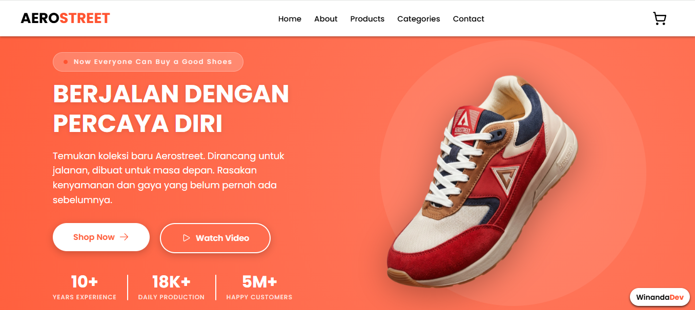

## 👟 Aerostreet - Now Everyone Can Buy a Good Shoes

**Aerostreet** adalah brand sepatu lokal Indonesia yang dikenal dengan produk berkualitas dengan harga terjangkau, sesuai dengan slogannya *"Now Everyone Can Buy a Good Shoes"*.

Website yang saya buat merupakan sebuah **landing page produk Aerostreet** yang dirancang untuk menampilkan dan mempromosikan produk secara digital dengan tampilan yang modern, menarik, dan responsif.

Landing page ini berfokus pada:
- Penyampaian informasi produk secara jelas  
- Tampilan visual yang menarik  
- Pengalaman pengguna (user experience) yang nyaman  
- Meningkatkan daya tarik dan minat pembeli  

---

## 🎓 Latar Belakang

Project ini dibuat sebagai **Project Akhir dari UKM IDC** dan berhasil meraih prestasi dalam kompetisi internal.

---

## 🏆 Prestasi

🥇 **Juara Terbaik Frontend**  
Dalam Lomba Hackathon Internal INSTIKI Techfest Vol. III yang diselenggarakan oleh INSTIKI Developer Club (2026) 

### 📜 Sertifikat

.jpg)

---

## 💻 Teknologi yang Digunakan

- HTML → struktur halaman  
- CSS → desain dan tampilan visual  
- JavaScript → interaksi pengguna  

---

## ✨ Fitur Utama

- 🎯 Tampilan landing page yang modern dan responsif  
- 🖼️ Menampilkan produk Aerostreet secara visual menarik  
- 📱 Responsive design (desktop, tablet, dan mobile)  
- 🎨 Layout rapi dan user-friendly  
- 🚀 Navigasi yang sederhana dan mudah digunakan  
- 📢 Section promosi produk (highlight fitur & keunggulan)  

---

## 📦 Tujuan Pengembangan

Project ini dibuat sebagai:

- Media promosi produk Aerostreet  
- Project akhir UKM IDC  
- Portofolio  

---
