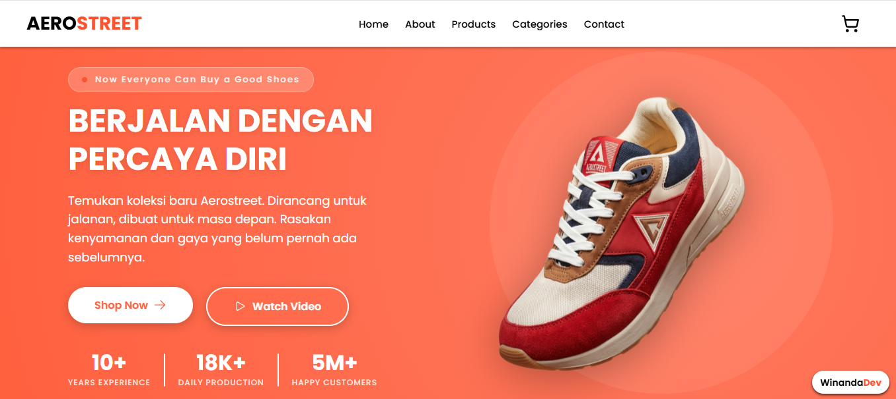
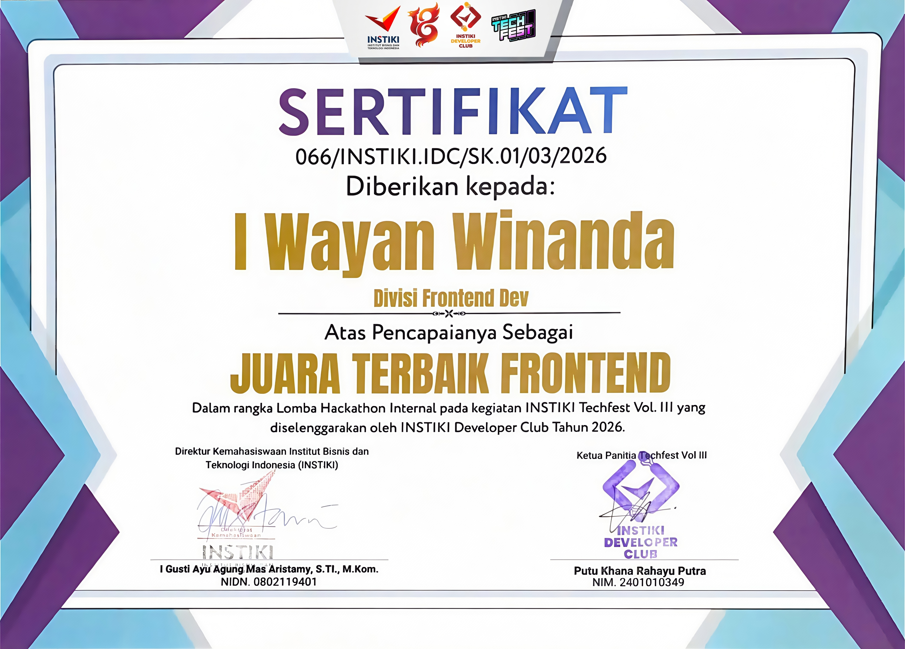

<div align="center">

# 👟 Aerostreet — Now Everyone Can Buy a Good Shoes
### *Modern, Interactive & High-Converting Product Landing Page*



<p align="center">
  <strong>Inovasi landing page e-commerce modern yang memadukan estetika visual dinamis, performa responsif, dan interaktivitas tinggi.</strong>
</p>

[](https://developer.mozilla.org/en-US/docs/Web/HTML)
[](https://developer.mozilla.org/en-US/docs/Web/CSS)
[](https://developer.mozilla.org/en-US/docs/Web/JavaScript)
[](https://greensock.com/gsap/)
[](https://swiperjs.com/)
[](#-penghargaan--prestasi)

</div>

---

## 📖 Ringkasan Proyek

**Aerostreet Landing Page** adalah representasi website e-commerce modern yang dirancang khusus untuk mempromosikan produk dari **Aerostreet**, brand sepatu dan fashion lokal nomor satu di Indonesia yang mengusung filosofi *"Now Everyone Can Buy a Good Shoes"*.

Website ini dibangun dengan pendekatan **Desktop-First (Responsive Design)**, estetika visual dinamis, serta micro-interactions tingkat tinggi untuk menghadirkan pengalaman belanja online (*User Experience*) yang imersif, cepat, intuitif, dan berkonversi tinggi.

---

## 🏆 Penghargaan & Prestasi

> [!IMPORTANT]
> Proyek ini dinobatkan sebagai peraih penghargaan **Juara 1 Karya Terbaik Kategori Frontend** pada ajang bergengsi:
>
> 🥇 **Juara Terbaik Frontend - Hackathon Internal INSTIKI Techfest Vol. III (2026)**  
> Diselenggarakan oleh **INSTIKI Developer Club (IDC)**.

<div align="center">
  
  <p><em>Sertifikat Resmi Juara Terbaik Frontend - INSTIKI Developer Club (2026)</em></p>
</div>

---

## ✨ Fitur-Fitur Utama

### 🎨 Desain & Antarmuka Visual
* **Modern Aesthetic & Dynamic Hero Section:** Desain banner hero interaktif dilengkapi tipografi kontras (Google Fonts *Montserrat* & *Poppins*), lencana statistik pelanggan (*5M+ Happy Customers*), dan floating visual produk utama.
* **Smart Glassmorphism & Micro-Interactions:** Efek blur transparan pada komponen navigasi, hover state interaktif pada kartu produk, serta transisi smooth di setiap tombol aksi.
* **Fully Responsive Across All Devices:** Layout fleksibel yang dioptimalkan secara presisi untuk Desktop Ultra-Wide, Laptop, Tablet, hingga Layar Smartphone (Mobile).

### 🚀 Interaktivitas & Animasi
* **🏎️ Smooth Product Carousel (Swiper.js):** Showcase katalog produk unggulan dengan fitur drag/swipe sentuh, autoplay mulus, serta pagination adaptif sesuai lebar layar.
* **🚚 3D Truck Delivery Animation (GSAP):** Micro-interaction unik pada tombol *"Add to Cart"* yang mengubah tombol menjadi animasi truk pengantar paket secara dinamis.
* **🛒 Dynamic Cart Counter & Dedicated Cart Page:** Logika penambahan jumlah item keranjang secara instan di navbar header yang terintegrasi dengan halaman keranjang terpisah (`cart.html`).
* **🔔 Toast Notification System:** Pemberitahuan pop-up interaktif otomatis saat pengguna berhasil menambahkan produk ke dalam keranjang belanja.
* **🎭 Scroll-Driven Reveals (AOS):** Animasi elemen masuk (*fade-in*, *zoom-in*, *slide-up*) saat halaman digulir dengan konfigurasi offset adaptif.

### 🛡️ Keamanan & Optimasi
* **Content Protection System:** Fitur proteksi terintegrasi untuk mencegah inspect element via shortcut keyboard (F12, Ctrl+Shift+I/J/C, Ctrl+U) dan klik kanan mouse.
* **Asset Optimization & SEO-Friendly:** Seluruh katalog produk telah dioptimasi menggunakan format next-gen modern (**WebP**), semantic markup HTML5 lengkap dengan Meta Open Graph & Twitter Cards, serta penamaan file berbasis *kebab-case* yang ramah mesin pencari.
* **Dynamic Year Automation:** Pembaruan tahun hak cipta secara otomatis pada footer tanpa perlu diedit manual.

---

## 🛠️ Teknologi & Library

Proyek ini dibangun menggunakan teknologi web murni (*Vanilla Web Technologies*) yang dikombinasikan dengan library animasi modern:

| Teknologi / Library | Versi / Sumber | Fungsi & Peran |
| :--- | :--- | :--- |
| **HTML5** | W3C Standard | Struktur semantik halaman, meta tags SEO, dan aksesibilitas. |
| **CSS3** | Modern Specification | CSS Variables, Flexbox, CSS Grid, Media Queries, Custom Scrollbar. |
| **JavaScript (ES6+)** | Vanilla JS | Logika interaksi, DOM manipulation, kalkulasi keranjang, dan event handlers. |
| **GSAP (GreenSock)** | v3.x CDN | Engine animasi berperforma tinggi untuk efek tombol *Add to Cart Truck Delivery*. |
| **Swiper.js** | v11.x CDN | Komponen slider produk responsif dengan touch-swipe mobile support. |
| **AOS (Animate On Scroll)** | v2.3.x CDN | Tracing viewport scroll untuk memicu animasi masuk pada setiap section. |
| **Google Fonts** | Montserrat & Poppins | Tipografi modern dengan keterbacaan tinggi (*high readability*). |

---

## 📂 Struktur Direktori Proyek

Arsitektur folder telah diorganisasi mengikuti standar industri web development profesional:

```text
aerostreet-landing-page/
├── assets/
│   ├── icons/
│   │   └── favicon.ico                      # Icon browser & shortcut tab
│   └── images/
│       ├── brand/                           # Identitas visual & aset hero utama
│       │   ├── hero-osaka.webp              # Foto produk hero banner
│       │   ├── logo-aerostreet.png          # Logo resmi resolusi tinggi
│       │   └── og-image.jpg                 # Gambar Open Graph social share
│       ├── previews/                        # Preview visual untuk README & portofolio
│       │   └── landing-page-preview.png     # Tangkapan layar penuh landing page
│       └── products/                        # Katalog foto produk berdasarkan kategori
│           ├── accessories/                 # Kategori parfum & perawatan
│           │   ├── parfum-couple.webp
│           │   ├── parfum-discovery-set.webp
│           │   └── parfum-manly.webp
│           ├── apparel/                     # Kategori pakaian & hoodie
│           │   ├── hoodie-take-me-home.webp
│           │   ├── kemeja-relaxed-moza.webp
│           │   ├── kemeja-relaxed-orry.webp
│           │   └── tshirt-boxy-muse.webp
│           ├── sandals/                     # Kategori sandal kasual
│           │   ├── hugo-kream.webp
│           │   └── zoe-kream.webp
│           └── shoes/                       # Kategori sepatu sneakers
│               ├── classic-navy.webp
│               ├── denim-caknan.webp
│               └── orlando-krem.webp
├── docs/
│   └── certificates/                        # Dokumentasi pencapaian & sertifikat lomba
│       └── best-frontend-idc-2026.jpg       # Sertifikat Juara Frontend Hackathon 2026
├── cart.html                                # Halaman keranjang belanja responsif
├── index.html                               # Halaman utama landing page e-commerce
├── README.md                                # Dokumentasi resmi proyek
├── script.js                                # Script interaktivitas & logika aplikasi
└── style.css                                # Stylesheet utama & desain sistem visual
```

---

## ⚡ Panduan Menjalankan Proyek Secara Lokal

Proyek ini tidak memerlukan dependensi build tools yang rumit (*zero setup required*):

### 1. Kloning Repositori
```bash
git clone https://github.com/winanda150/aerostreet-landing-page.git
```

### 2. Buka Direktori Proyek
```bash
cd aerostreet-landing-page
```

### 3. Jalankan Halaman
Anda dapat langsung membuka file [index.html](index.html) di browser Anda, atau menggunakan ekstensi **Live Server** di VS Code:
* Klik kanan pada file `index.html` di VS Code.
* Pilih **"Open with Live Server"**.
* Website akan berjalan pada `http://127.0.0.1:5500/` dengan fitur *live reload*.

---

## 📄 Lisensi & Hak Cipta

* Seluruh logo, materi visual, dan identitas merek adalah hak cipta milik **PT Adco Pakis Mas** (Aerostreet).
* Kode sumber website ini dibuat untuk keperluan portofolio, kompetisi edukatif, dan pengembangan antarmuka web.

---

## 👨‍💻 Kontributor & Kredit

Dibuat dengan penuh dedikasi dan cinta oleh **WinandaDev**.

<p align="left">
  <a href="https://github.com/winanda150" target="_blank">
    
  </a>
  <a href="https://www.instagram.com/wiinaandaa_" target="_blank">
    
  </a>
  <a href="https://wa.me/6285964393536" target="_blank">
    
  </a>
  <a href="https://www.facebook.com/share/1E7HcpEHtH" target="_blank">
    
  </a>
</p>

---

<div align="center">
  <sub>Dibuat dengan dedikasi dan cinta untuk kemajuan brand lokal Indonesia 🇮🇩</sub>
</div>